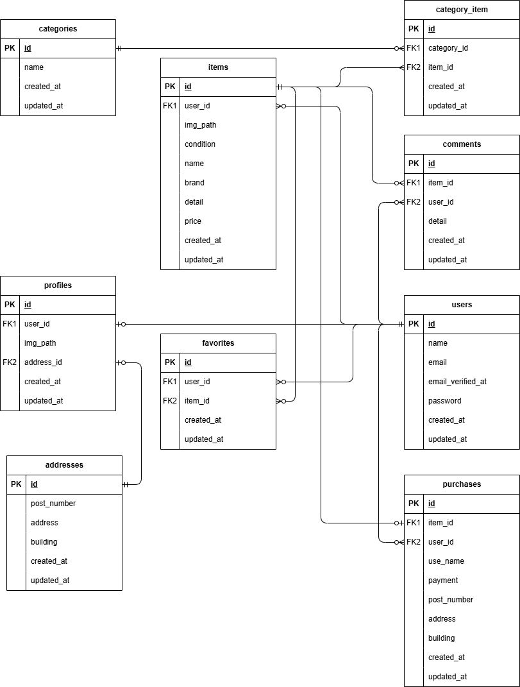

## アプリケーション名

coachtech フリマ

## 環境構築

### Docker ビルド

1.  `git clone git@github.com:kasahara-dev/kasahara-mogi1.git`
2.  `cd kasahara-mogi1`
3.  `docker-compose up -d --build`

> [!IMPORTANT]
> MySQL は、OS によって起動しない場合があるのでそれぞれの PC に合わせて docker-compose.yml ファイルを編集

### Stripe 設定

1. Stripe テスト用アカウントを取得
2. Stripe コンソール画面よりコンビニ払い、カード払いを有効化

### Laravel 環境構築

1. `docker compose exec php bash`
2. `composer install`
3. .env.example ファイルから.env を作成し、各環境変数を下記に変更

- `STRIPE_PUBLIC_KEY={Stripe テスト用アカウントの公開鍵}`
- `STRIPE_SECRET_KEY={Stripe テスト用アカウントの秘密鍵}`

4. `php artisan key:generate`
5. `php artisan migrate`
6. `php artisan db:seed`
7. `php artisan storage:link`

> [!IMPORTANT]
> "The stream or file could not be opened"エラーが発生した場合
> src ディレクトリにある storage ディレクトリに権限を設定
> `chmod -R 777 storage`

## テスト手順

1. `docker compose exec mysql bash`
2. `mysql -u root -p`
3. `root`
4. `CREATE DATABASE demo_test;`
5. `exit`
6. .env ファイルから.env.testing を作成し、各環境変数を下記に変更

- `APP_ENV=test`
- `APP_KEY=`
- `DB_DATABASE=demo_test`
- `DB_USERNAME=root`
- `DB_PASSWORD=root`

7. `docker compose exec php bash`
8. `php artisan key:generate --env=testing`
9. `php artisan config:clear`
10. `php artisan migrate --env=testing`
11. `php artisan test`

> [!WARNING]
>
> - テストケース ID12 支払い方法選択機能について、Javascript テスト対応ができなかったため、テスト未実装です
> - テストケース ID16 メール認証機能のメール送信機能ととメール認証完了後遷移について、メールテスト対応ができなかったため、テスト未実装です

## 使用技術

- PHP 8.1.33
- Laravel 8.83.8
- MySQL 8.0.26

## ER 図

## URL

トップページ：http://localhost/

## テストユーザー

- テストユーザー 1(住所登録済みユーザー)メールアドレス：`test1@example.com` パスワード：`password`
- テストユーザー 2(住所未登録ユーザー)メールアドレス：`test2@example.com` パスワード：`password`

> [!IMPORTANT]
> テストデータでは、すでに複数ユーザーで出品、購入、お気に入り、コメント登録がされています
